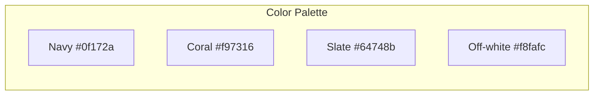

# Modern UI/UX Improvements for JMF 509 Warehouse

## Design Direction

**Aesthetic:** Modern e-commerce (clean, product-focused)  
**Palette:** Fresh — deep navy primary (#0f172a), coral accent (#f97316), soft neutrals (#f8fafc, #64748b)




---

## 1. Typography

**Current:** Roboto (generic)  
**New:** [DM Sans](https://fonts.googleapis.com/css2?family=DM+Sans:wght@400;500;600;700) for body, [Outfit](https://fonts.googleapis.com/css2?family=Outfit:wght@500;600;700) for headings

- Update [jmf509_styles.css](jmf509_styles.css) font imports and `font-family` declarations
- Heading hierarchy: `h1` 2rem/700, `h2` 1.5rem/600, `h3` 1.25rem/600

---

## 2. Layout & Structure

**Header ([Extras/header.php](Extras/header.php))**

- Sticky header on scroll (position: sticky, top: 0, z-index)
- Compact layout: logo left, welcome + nav right
- Add subtle bottom border instead of heavy gradient
- Remove rounded corners for cleaner edge-to-edge feel

**Navigation ([Extras/nav.php](Extras/nav.php))**

- Horizontal nav with proper spacing (gap: 1.5rem)
- Cart badge: pill-style count indicator (background: coral, white text)
- Mobile: hamburger menu (CSS-only or minimal JS) for small screens

**Main content**

- Increase max-width to 1280px for product grids
- Consistent section spacing (2rem between sections)
- Card-based layout with subtle shadows (0 1px 3px rgba)

---

## 3. Product Cards & Grid

**Item tiles ([jmf509_styles.css](jmf509_styles.css) `.item-tile`)**

- White card with 1px border (#e2e8f0), 12px border-radius
- Image: aspect-ratio 1/1, object-fit cover, rounded top corners
- Hover: lift effect (translateY -4px), stronger shadow
- "View Details" → "View" with arrow icon (→) or chevron
- Price: larger, bold, coral accent
- Optional: "Add to cart" quick-action on hover (secondary button)

**Grid**

- `grid-template-columns: repeat(auto-fill, minmax(260px, 1fr))`
- Gap: 24px

---

## 4. Hero Section

**Current:** Tall gradient block  
**New:** Shorter hero (180px), cleaner

- Background: subtle gradient (navy → slate-800) or solid navy
- Text: white, centered, concise
- CTA button: coral background, white text, rounded-full (pill shape)
- Remove heavy green gradient

---

## 5. Forms & Inputs

**Inputs (`.form-group input`, `select`, `textarea`)**

- Border: 1px solid #e2e8f0
- Focus: ring 2px coral, outline none
- Padding: 12px 16px
- Border-radius: 8px
- Transition on focus

**Buttons**

- Primary: coral (#f97316), white text, 10px 20px, rounded-lg
- Hover: darken coral (#ea580c)
- Secondary: outline style (border coral, transparent bg)

---

## 6. Alerts & Feedback

- Success: green-50 bg, green-700 text, green-200 border
- Error: red-50 bg, red-700 text, red-200 border
- Rounded-lg, padding 16px
- Optional: icon prefix (✓ / ✕) for quick scan

---

## 7. Footer ([Extras/footer.php](Extras/footer.php))

**Current:** Shows "Page last updated", "Server time" (technical, not user-friendly)  
**New:**

- Remove server/time metadata
- Simple: copyright, "Essential goods & logistics for Haiti", Contact link
- Background: #f1f5f9 (light gray)
- Padding: 24px, smaller font (0.875rem)

---

## 8. Mobile Responsiveness

- Breakpoint: 768px
- Header: stack logo + nav on small screens, or collapse nav
- Product grid: 1–2 columns on mobile
- Payment layout: already responsive (grid → 1 col)
- Touch targets: min 44px for buttons/links
- Nav: consider horizontal scroll or hamburger for many links

---

## 9. Micro-interactions

- Button hover: 0.2s transition
- Card hover: transform + shadow transition
- Link underline on hover (optional)
- Focus visible: outline for keyboard users (accessibility)

---

## 10. CSS Variables

Introduce CSS custom properties in [jmf509_styles.css](jmf509_styles.css) for easy theming:

```css
:root {
  --color-primary: #0f172a;
  --color-accent: #f97316;
  --color-text: #334155;
  --color-muted: #64748b;
  --color-bg: #f8fafc;
  --radius-sm: 6px;
  --radius-md: 8px;
  --radius-lg: 12px;
  --shadow-sm: 0 1px 3px rgba(0,0,0,0.08);
  --shadow-md: 0 4px 12px rgba(0,0,0,0.1);
}
```

---

## Files to Modify


| File                                   | Changes                                                             |
| -------------------------------------- | ------------------------------------------------------------------- |
| [jmf509_styles.css](jmf509_styles.css) | Full restyle: variables, typography, colors, components, responsive |
| [Extras/header.php](Extras/header.php) | Add sticky class, adjust structure for logo/nav layout              |
| [Extras/footer.php](Extras/footer.php) | Simplify content, remove technical metadata                         |
| [Extras/nav.php](Extras/nav.php)       | Add cart badge styling class, optional mobile nav markup            |
| [app.js](app.js)                       | Optional: cart badge animation on update                            |


---

## Implementation Order

1. Add CSS variables and typography (foundation)
2. Update header, nav, footer structure and styles
3. Restyle hero, main, product cards
4. Forms, buttons, alerts
5. Mobile breakpoints and polish

